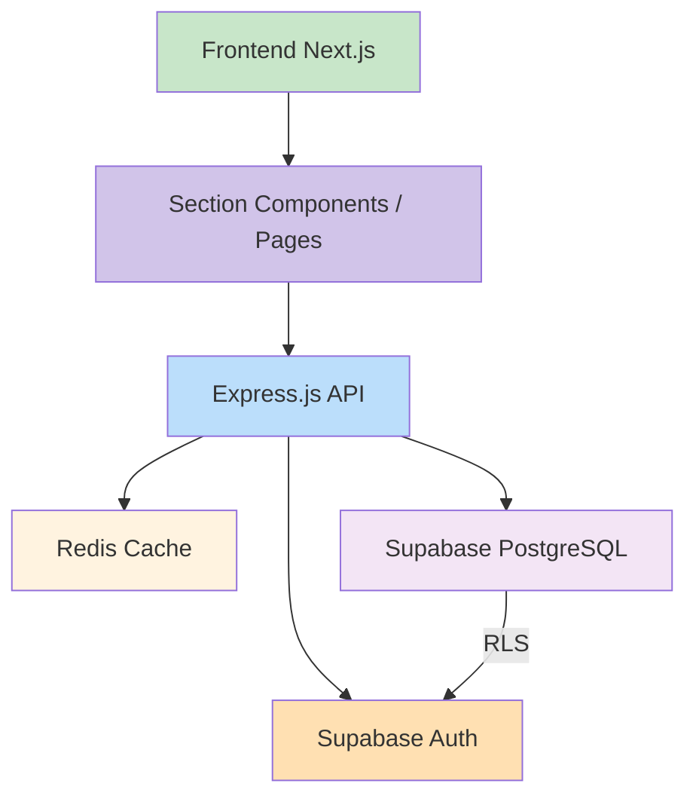

# RAPPORT 03 - Architecture et Interfaces de PromoHouse

## 1. Description de l’architecture globale du système

PromoHouse est une application web front-end construite avec **Next.js 16** et **TypeScript**, reliée à un backend API **Express.js**. Ce backend gère la logique métier et communique avec **Supabase PostgreSQL** pour les données et l’authentification, tandis que **Redis** fournit du cache pour accélérer les requêtes fréquentes.

- **Frontend** : App Router, pages légères et sections réutilisables
- **Section architecture** : chaque section a son propre dossier avec `components/` et `utils/`
- **Backend** : Express.js pour les routes API et la logique métier (business registration, publication de deals, likes, commentaires, sauvegardes)
- **Data layer** : Supabase pour les données utilisateur, deals, commentaires et relations commerciales
- **Sécurité** : Supabase Auth + RLS pour contrôler l’accès aux données
- **Performance** : Redis pour le cache des listes de deals et des contenus partagés

## 2. Diagramme de l’architecture du projet

## 3. Maquettes des principales interfaces utilisateur

### Home
- Navbar avec recherche, filtrage par localisation, connexion et profil
- Section Hero avec CTA
- Grille de deals, aperçu rapide et actions rapides
- Section de marchands
- Section commentaires et avis

### Login / Signup
- Double panneau visuel
- Formulaire utilisateur
- Appel à l’action vers l’inscription et la connexion

### Business Registration
- Formulaire d’inscription dédié aux commerçants
- Informations légales, adresse, description, catégorie et contact

### Deal Posting
- Formulaire de création d’annonce
- Champs pour titre, description, images, prix, stock, localisation
- Publication, modification et gestion des deals

### Deal Detail
- Galerie d’images du produit
- Description complète du deal
- Éléments d’action : ajouter au panier, like, sauvegarder, partager
- Informations marchand et statut du deal

### Complete Profile
- Formulaire de profil utilisateur
- Adresse, téléphone, préférences, photo de profil
- Vérification de complétude de profil

## 4. Parcours utilisateur

### 4.1 Visiteur non authentifié
- Arrive sur la Home
- Parcourt les deals et les marchands
- Choisit de s’inscrire ou de se connecter

### 4.2 Utilisateur authentifié
- Accède à l’expérience complète
- Filtre et consulte des deals
- Ajoute des likes, sauvegarde ou commente
- Retourne vers d’autres deals ou son profil

### 4.3 Commerçant
- S’inscrit via Business Registration
- Crée et publie des deals
- Consulte ses annonces et met à jour les informations

### Flux standard
- Home → Signup / Login → Authentification
- Authentifié → Home → Deal detail → Like / Save / Comment
- Business → Registration → Publish Deal → Gérer annonces

## 5. Logique métier spécifique

- **Business registration** : gestion du compte commerçant, validation des informations et création de profil métier
- **Posting deals** : publication, mise à jour, stockage d’images, dates de disponibilité et tarification
- **Likes / Comments / Saves** : interactions sociales stockées en base, utilisées pour recommandations et engagement
- **Caching** : Redis accélère les pages à fort trafic et réduit les temps de chargement

---

**Document mis à jour : Avril 2026**
